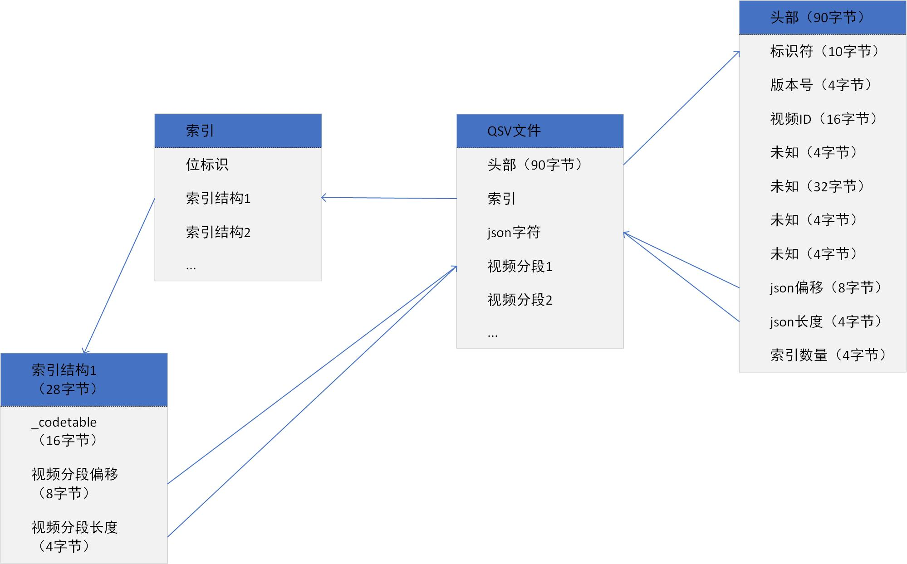

# 揭秘爱奇艺qsv文件背后的秘密

想做影视二次剪辑的朋友，想获取爱奇艺的高清资源吗？想知道如何将qsv文件导入剪映吗？本文带大家揭秘爱奇艺qsv文件背后的秘密，文章最后提供了绿色免费的转换工具可以将qsv文件转换为可剪辑的flv或MP4文件。

## 什么是qsv文件

QSV是一种加密的视频文件格式。是爱奇艺公司研发的一种视频文件格式，故QSV格式只能使用奇艺客户端、爱奇艺万能播放器播放。因此想要将QSV文件转换成其他格式的视频文件就需要知道QSV文件的加密方式，通过查阅相关资料和研究得出了一些结论。

QSV文件包含头部信息、索引信息、json字符串以及视频分段信息。



## 头部信息

头部信息为整个QSV文件的前90字节。包含标识符、版本号、视频ID、json字符串的绝对文件偏移和大小、视频索引信息的数量。

| 偏移（绝对文件地址） | 长度（字节） | 字段名         | 解释                       |
| ---------- | ------ | ----------- | ------------------------ |
| 0x0        | 0xA    | signature   | 标识符，"QIYI VIDEO"         |
| 0xA        | 0x4    | version     | 版本号，0x01或0x02            |
| 0xE        | 0x10   | vid         | 视频ID                     |
| 0x1E       | 0x4    | \_unknown1  | 未知，必须为0x01               |
| 0x22       | 0x20   | \_unknown2  | 未知，全部为0x00               |
| 0x42       | 0x4    | \_unknown3  | 未知，待分析                   |
| 0x46       | 0x4    | \_unknown4  | 未知，待分析                   |
| 0x4A       | 0x8    | json\_offset | [json字符串](#json字符串)的的绝对文件偏移 |
| 0x52       | 0x4    | json\_size   | [json字符串](#json字符串)的的大小     |
| 0x56       | 0x4    | nb\_indices | 视频[索引信息](#索引信息)的数量             |

## 索引信息

| 偏移（绝对文件地址） | 长度（字节）              | 字段名             | 解释               |
| ---------- | ------------------- | --------------- | ---------------- |
| 0x5A       | nb\_indices + 7) >>3 | \_unknown\_flag | 位标识，一个索引对应一位，待分析 |
| 上一字段之后     | nb\_indices \* 0x1C   | indices         | 索引结构体数组          |

每个索引结构体的大小为0x1C，经过加密，记录[视频分段信息](#视频分段信息)的偏移和大小。

| 偏移（相对于结构体首地址） | 长度（字节） | 字段名             | 解释          |
| ------------- | ------ | --------------- | ----------- |
| 0x0           | 0x10   | \_codetable     | 用于后面两个字段的解密 |
| 0x10          | 0x8    | segment\_offset | 视频分段的绝对文件偏移 |
| 0x18          | 0x4    | segment\_size   | 视频分段的大小     |

## json字符串

通过头部信息中的json字符串的的绝对文件偏移和大小获取。字符串为加密数据，需要进行解密，解密算法如下：

```c
// decryption algorithm for some segments in qsv version 0x1
void decrypt_1(BYTE* buffer, DWORD size) {
    static BYTE dict[] = {0x62, 0x67, 0x70, 0x79};
    for(int i = 0; i < size; ++i) {
        DWORD j = ~i & 0x3;
        buffer[i] ^= dict[j];
    }
}
```

## 视频分段信息

一个qsv文件包含多段视频文件，通过[索引信息](#索引信息)中的segment\_offset和segment\_size定位，前0x400字节经过加密。老版本解密算法同[json字符串](#json字符串)，新版本的解密算法为：

```c
// decryption algorithm for some segments in qsv version 0x2
void decrypt_2(BYTE* buffer, DWORD size) {
    DWORD x = 0x62677079;
    for(DWORD i = size - 1; i != 0; --i) {
        x = (x << 1) | (x >> 31);
        x ^= buffer[i];
    }
    for(DWORD i = 1; i < size; ++i) {
        x ^= buffer[i] & 0xFF;
        x = (x >> 1) | (x << 31);
        DWORD j = x % i;
        BYTE tmp = buffer[j];
        buffer[j] = tmp ^ (BYTE)~buffer[i];
        buffer[i] = tmp;
    }
}
```

已发现的视频格式有flv（旧版客户端）、mpeg-ts（新版客户端）。

## 总结

提取出QSV文件中的视频信息后需要转换其他格式，则需要ffmpeg神器了。这里提供的免费转换工具已经集成了ffmpeg，可以直接将QSV文件转换为MP4，关注公众号`OriginalTech`回复QSV获取。

需要注意的是**最新版**爱奇艺客户端(10.0以上版本)下载的QSV文件采用了**全新的加密方式**，目前还转换。我们也提供老版本的爱奇艺客户端，关注公众号`OriginalTech`回复QIYI获取。

## 后记

本文参考开源项目[qsv2flv](https://github.com/btnkij/qsv2flv.git)，项目地址：<https://github.com/btnkij/qsv2flv.git>

该项目采用`c`语言和`Qt`开发，为了帮助不会`c`的`Java`开发理解，作者翻译了`Java`版本，关注我下一篇带你手把手撸一遍。
