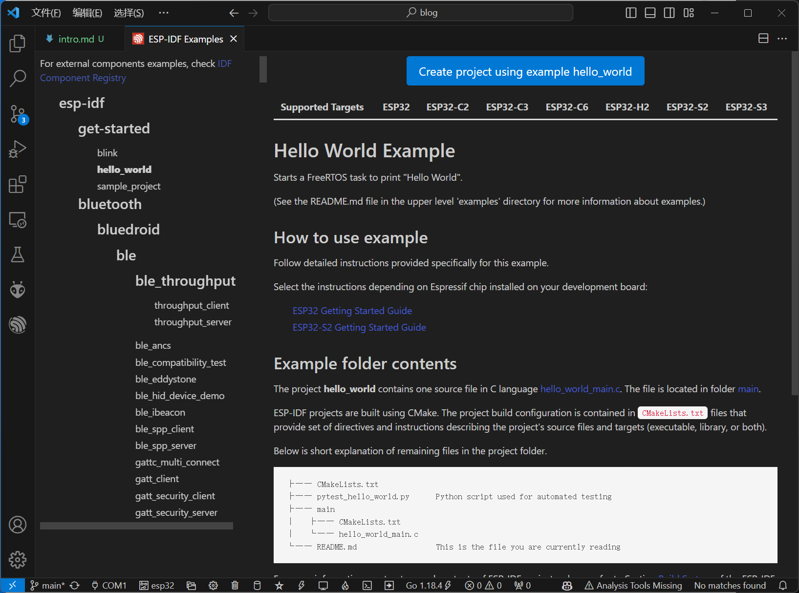
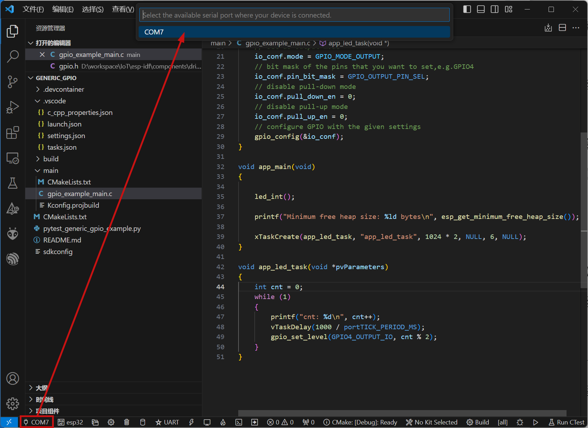
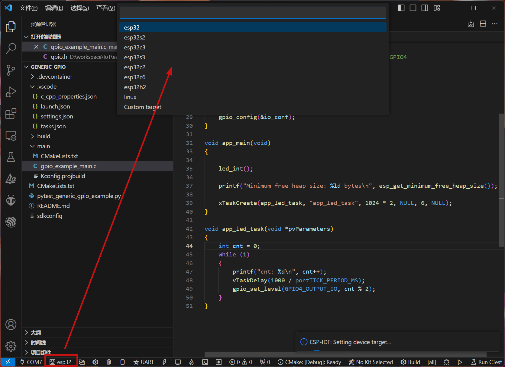
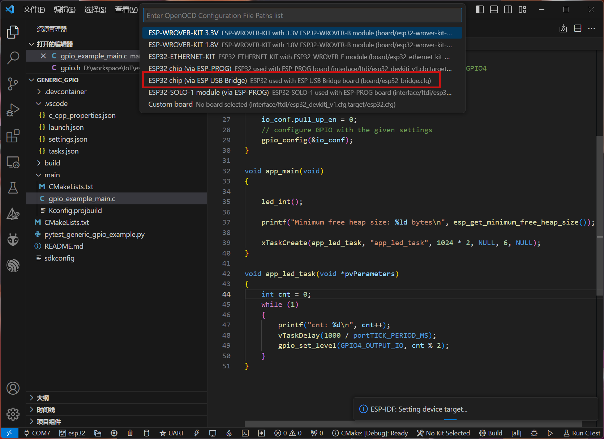
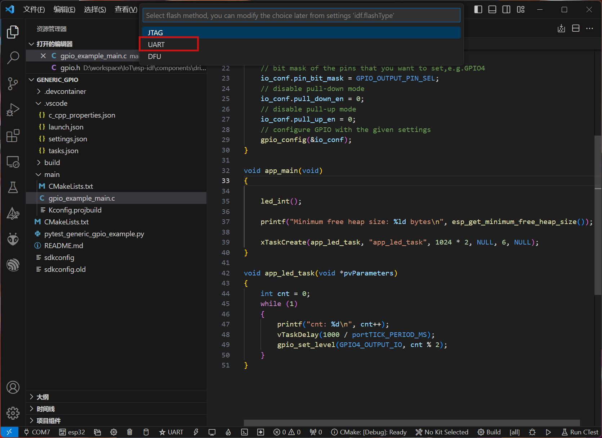
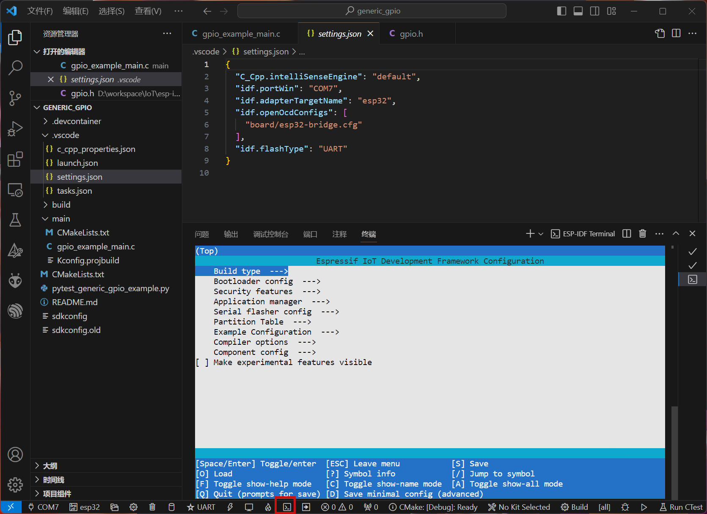
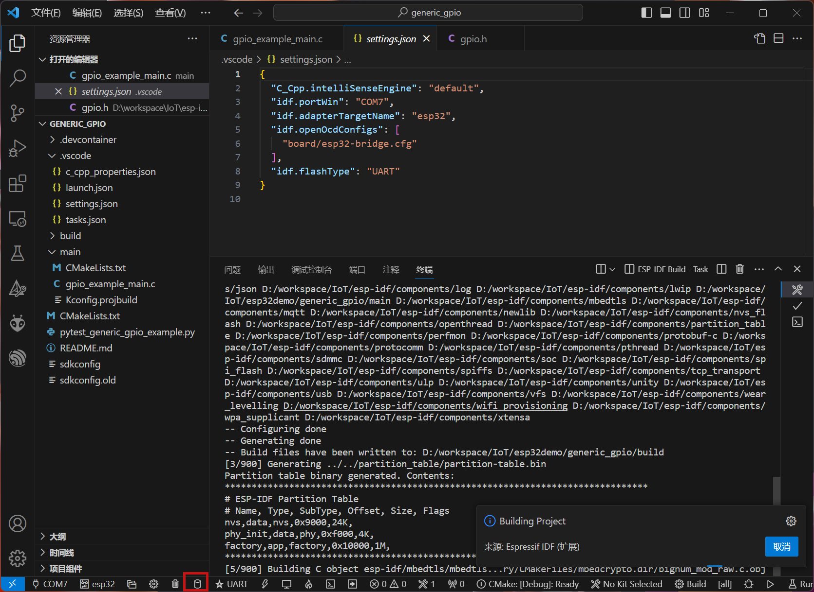
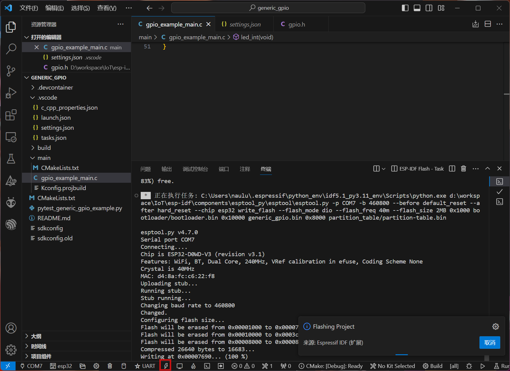
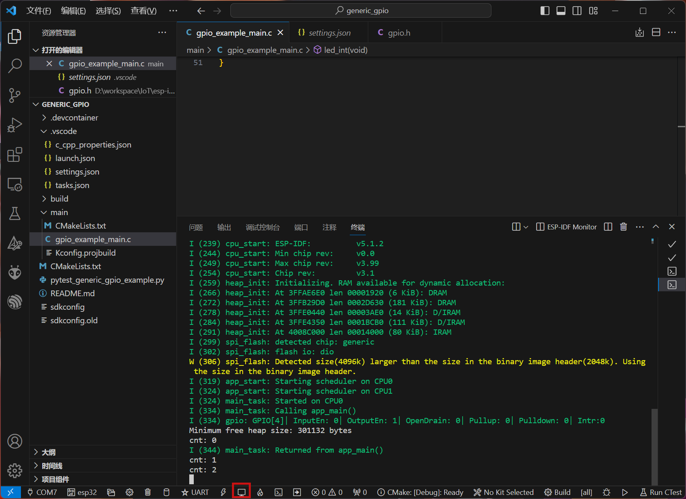

## 介绍

ESP32是一款芯片，硬件上集成了蓝牙、WIFI、低功耗、双核处理器等功能，软件上提供了完整的开发框架，可以用来开发物联网设备。可以详见[乐鑫公司官网](https://www.espressif.com/zh-hans)

## 开发环境搭建

常见的开发方式有两种，一种是使用Arduino IDE，一种是使用ESP-IDF。本文主要介绍使用ESP-IDF的方式。

### 1.1 安装ESP-IDF

ESP-IDF是ESP32的开发框架，可以在[ESP-IDF官网](https://docs.espressif.com/projects/esp-idf/zh_CN/latest/esp32/get-started/index.html)下载，也可以在[ESP-IDF Github](https://github.com/espressif/esp-idf)下载。

本文主要介绍在Windows通过VSCode安装ESP-IDF的方法。

- 打开插件管理搜索`espressif.esp-idf-extension`安装插件。并根据指引完成下载和安装。
- 增加环境变量`IDF_PATH`，值为ESP-IDF的路径。例：`D:\workspace\IoT\esp-idf`
- 增加环境变量`IDF_TOOLS_PATH`，值为ESP-IDF的工具路径。例：`C:\Users\naulu\.espressif`

### 1.2 VSCode配置

在当前工程`.vscode`文件夹中新增`c_cpp_properties.json`,内容如下：

```json
{
    "configurations": [
        {
            "name": "ESP-IDF",
            "compilerPath": "${config:idf.toolsPath}\\tools\\xtensa-esp32-elf\\esp-12.2.0_20230208\\xtensa-esp32-elf\\bin\\xtensa-esp32-elf-gcc.exe",
            "includePath": [
                "${config:idf.espIdfPath}/components/**",
                "${config:idf.espIdfPathWin}/components/**",
                "${config:idf.espAdfPath}/components/**",
                "${config:idf.espAdfPathWin}/components/**",
                "${workspaceFolder}/**"
            ],
            "browse": {
                "path": [
                    "${config:idf.espIdfPath}/components",
                    "${config:idf.espIdfPathWin}/components",
                    "${config:idf.espAdfPath}/components/**",
                    "${config:idf.espAdfPathWin}/components/**",
                    "${workspaceFolder}"
                ],
                "limitSymbolsToIncludedHeaders": false
            },
            // 此配置可以解决编译时的警告
            "compileCommands": "${workspaceFolder}/build/compile_commands.json"
        }
    ],
    "version": 4
}
```

### 1.3 新建示例工程

按下`F1`选择`ESP-IDF:展示示例项目`，选择`hello_world`示例工程完成创建。



### 1.4 配置开发环境

第一步：选择`COM`端口



第二步：选择`ESP32`开发板





第三步：选择`flash`模式



第四步：工程配置，打开`ESP-IDF`终端，输入`idf.py menuconfig`。



第五步：编译工程



第六步：烧录工程



第七步：查看串口输出



## FAQ

> Question：flash时提示`Failed to connect to ESP32: No serial data receiverd.`

::: info Answer
硬件故障
:::

> Question：`ESP32S3`flash完成后无法识别端口

::: info Answer
重置开发板，按住boot键不要松上电
:::
