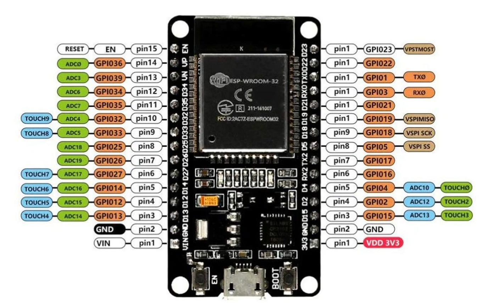
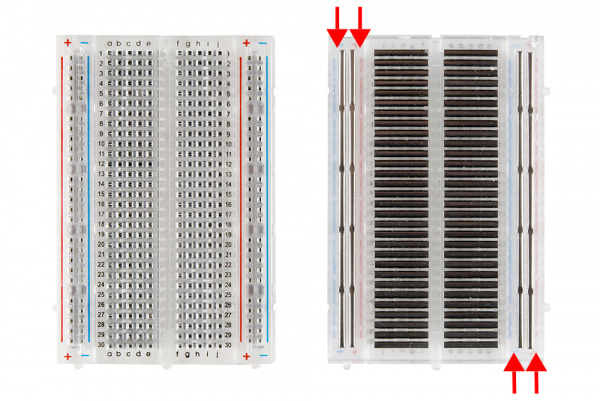
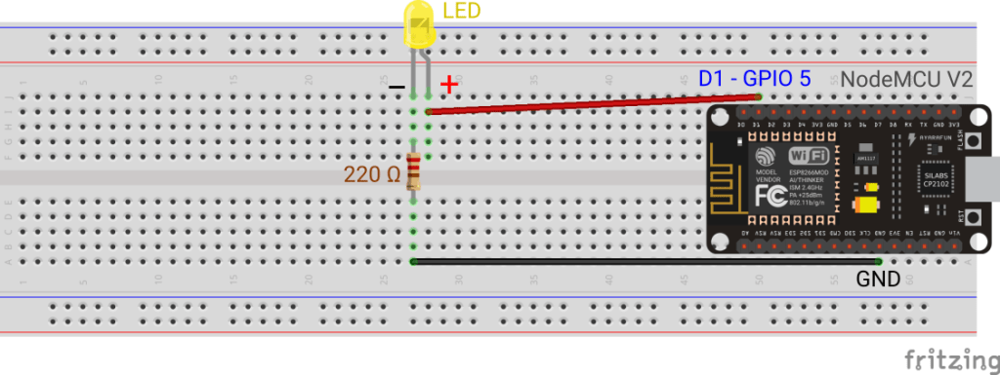
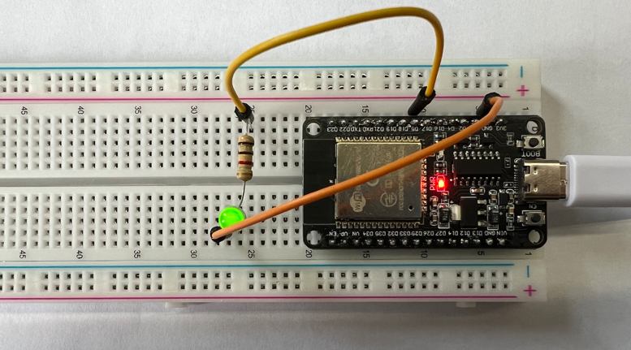

## 介绍

本文主要介绍如何使用`ESP32`的`GPIO`输出控制`LED`灯。

## 硬件准备

- ESP32开发板
- LED灯
- 220欧姆电阻
- 杜邦线若干
- 面包板

## ESP-WROOM-32引脚图



## 面包板介绍

面包板是一种用于快速搭建电路的工具，可以将电路板上的引脚连接到面包板上，通过面包板上的导线连接到其他引脚上，从而快速搭建电路。



## 电路图

`ESP32`的`GPIO`输出电压为`3.3V`，LED灯的额定电压为`2V`，额定电流为`20mA`，因此需要串联一个`220欧姆`的电阻。`GPIO5`的编号为`05`，对应的引脚连接电阻，电阻连接`LED`灯，`LED`灯的另一端连接`GND`接地。



## 示例代码

```c
#include <stdio.h>
#include <string.h>
#include <stdlib.h>
#include "freertos/FreeRTOS.h"
#include "freertos/task.h"
#include "freertos/queue.h"
#include "driver/gpio.h"

#define GPIO5_OUTPUT_IO 5
#define GPIO_OUTPUT_PIN_SEL (1ULL << GPIO5_OUTPUT_IO)

void app_led_task(void *pvParameters);

void led_int(void)
{
    // zero-initialize the config structure.
    gpio_config_t io_conf = {};
    // disable interrupt
    io_conf.intr_type = GPIO_INTR_DISABLE;
    // set as output mode
    io_conf.mode = GPIO_MODE_OUTPUT;
    // bit mask of the pins that you want to set,e.g.GPIO5
    io_conf.pin_bit_mask = GPIO_OUTPUT_PIN_SEL;
    // disable pull-down mode
    io_conf.pull_down_en = 0;
    // disable pull-up mode
    io_conf.pull_up_en = 0;
    // configure GPIO with the given settings
    gpio_config(&io_conf);
}

void app_main(void)
{

    led_int();

    printf("Minimum free heap size: %ld bytes\n", esp_get_minimum_free_heap_size());

    xTaskCreate(app_led_task, "app_led_task", 1024 * 2, NULL, 6, NULL);
}

void app_led_task(void *pvParameters)
{
    int cnt = 0;
    while (1)
    {
        printf("cnt: %d\n", cnt++);
        vTaskDelay(1000 / portTICK_PERIOD_MS);
        gpio_set_level(GPIO5_OUTPUT_IO, cnt % 2);
    }
}
```

## 最终成果


