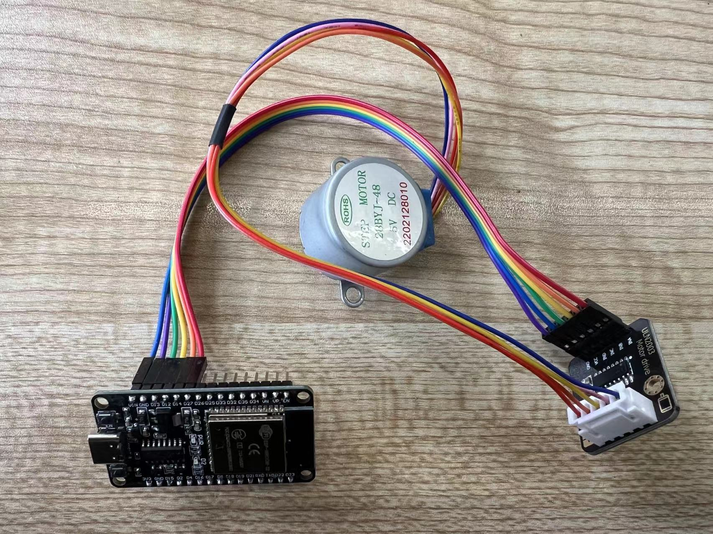

## 介绍

本文主要介绍如何使用`ESP32`的`GPIO`输出控制步进电机。

## 硬件准备

- ESP32开发板
- 步进电机
- ULN2003驱动板
- 杜邦线若干
- 面包板

## 步进电机介绍

首先来看一下步进电机的样子，本文介绍采用平时最常见也是最简单的28BYJ-48，这是一个五线四项电机。

五线：顾名思义外部五条线。

四项：电机内部的定子上有8个齿，正对着的2个齿上的绕组又是串联在一起的，也就是说正对着的2个绕组总是会同时导通或关断的，如此就形成了4相。


## 步进电机原理

步进电机是一种将电脉冲信号转换成相应角位移或线位移的电动机。每输入一个脉冲信号，转子就转动一个角度或前进一步，其输出的角位移或线位移与输入的脉冲数成正比，转速与脉冲频率成正比。

**通俗易懂的说：就是给不同的项轮流通电，在电磁感应的作用下，每次产生一个很小的角位移，连贯起来就带动了电机的转动，从而驱动负载。**


ABCD为定子，上面绕有线圈，为四相，与之相对应的对面四个定子上面也有线圈，相对应的两个定子之间线圈是相互连接形成一个绕组。

### 单四拍模式

如当前为初始状态，B相导通，对0的吸引力最大。

接下来B断开，C导通，1和C相之间夹角最小被吸引过去，被吸引过去之前2和D相之间夹角为1和C相之间夹角的2倍，1被吸引到C以后，2和D之间最近，此时0和A之间的夹角为2和D之间的2倍，

接下来C断开，D导通，2被吸引到D，此时0距离A最近

D断开A导通，0被吸引到A相，至此一个周期完成

### 双拍工作模式

每次给两个线圈通电，通过改变通电的线圈从而使步进电机转动 五线四相步进电机：在双拍工作方式下，线圈的通电方式依次是：AB、BC、CD、DA 即单拍工作方式下，线圈的通电方式依次是：A、B、C、D

### 单双拍（八拍工作方式）

单双拍工作方式就是单拍工作方式和双拍工作方式交替进行。 五线四相步进电机：A、AB、B、BC、C、CD、D、DA

## 步进电机驱动板


## 电路图


## 示例代码

在使用`esp-idf v5.0.1`框架开发`28BYJ-48`步进电机驱动时，发现使用延时产生脉冲驱动`ULN2003`，其最快延时到`10ms`，再小一点都无法驱动步进电机，`gpio`口也没有输出，相比之下51单片机使用延时可以正常的工作，esp32驱动的步进电机太慢了。其具体原因尚不明白，后来采用定时器产生脉冲，最终得以解决。以下内容则包含硬件通用定时器的简单驱动程序。（注：使用的`v5.0.1`版本，低版本可能无法使用）

```c
#include <stdio.h>
#include <string.h>
#include <stdlib.h>
#include "freertos/FreeRTOS.h"
#include "freertos/task.h"
#include "freertos/queue.h"
#include "driver/gpio.h"
#include "driver/gptimer.h"
#include "esp_log.h"

#define MOTOR_PIN_A GPIO_NUM_27
#define MOTOR_PIN_B GPIO_NUM_14
#define MOTOR_PIN_C GPIO_NUM_12
#define MOTOR_PIN_D GPIO_NUM_13

// 目标步数（剩余步数）
static uint32_t target_step = 0;
// 电机方向
static int8_t direction = -1;

static const char *TAG = "example";

// 定义步进电机的时序（一二相励磁方式）
static const uint8_t step_sequence[] = {
    (1 << 0) | (0 << 1) | (0 << 2) | (0 << 3), // Step 1
    (1 << 0) | (1 << 1) | (0 << 2) | (0 << 3), // Step 2
    (0 << 0) | (1 << 1) | (0 << 2) | (0 << 3), // Step 3
    (0 << 0) | (1 << 1) | (1 << 2) | (0 << 3), // Step 4
    (0 << 0) | (0 << 1) | (1 << 2) | (0 << 3),
    (0 << 0) | (0 << 1) | (1 << 2) | (1 << 3),
    (0 << 0) | (0 << 1) | (0 << 2) | (1 << 3),
    (1 << 0) | (0 << 1) | (0 << 2) | (1 << 3)};

void motor_init(void)
{
    gpio_config_t io_conf = {};
    // 禁用中断
    io_conf.intr_type = GPIO_INTR_DISABLE;
    // 设置为输出模式
    io_conf.mode = GPIO_MODE_OUTPUT;
    io_conf.pull_down_en = GPIO_PULLDOWN_DISABLE;
    io_conf.pull_up_en = GPIO_PULLUP_DISABLE;
    // 配置GPIO
    io_conf.pin_bit_mask = (1ULL << MOTOR_PIN_A) | (1ULL << MOTOR_PIN_B) |
                           (1ULL << MOTOR_PIN_C) | (1ULL << MOTOR_PIN_D);
    gpio_config(&io_conf);
}

static bool IRAM_ATTR step_timer_inr(gptimer_handle_t timer, const gptimer_alarm_event_data_t *edata, void *args)
{
    BaseType_t high_task_awoken = pdFALSE;
    // ESP_LOGI(TAG, "%lu", target_step);
    // ESP_LOGI(TAG, "11111");
    // 相序下标
    static int8_t phase_index = 0;
    switch (direction)
    {
    case 1:
    { // 顺时针旋转
        phase_index--;
        if (phase_index < 0)
        {
            phase_index = 7;
        }
        gpio_set_level(MOTOR_PIN_A, (step_sequence[phase_index] >> 0) & 0x1);
        gpio_set_level(MOTOR_PIN_B, (step_sequence[phase_index] >> 1) & 0x1);
        gpio_set_level(MOTOR_PIN_C, (step_sequence[phase_index] >> 2) & 0x1);
        gpio_set_level(MOTOR_PIN_D, (step_sequence[phase_index] >> 3) & 0x1);

        target_step--;
        if (target_step <= 0)
        {
            direction = -1;
        }
        break;
    }
    case 0:
    { // 逆时针旋转
        phase_index++;
        if (phase_index >= 8)
        {
            phase_index = 0;
        }
        gpio_set_level(MOTOR_PIN_A, (step_sequence[phase_index] >> 0) & 0x1);
        gpio_set_level(MOTOR_PIN_B, (step_sequence[phase_index] >> 1) & 0x1);
        gpio_set_level(MOTOR_PIN_C, (step_sequence[phase_index] >> 2) & 0x1);
        gpio_set_level(MOTOR_PIN_D, (step_sequence[phase_index] >> 3) & 0x1);

        target_step--;
        if (target_step <= 0)
        {
            direction = -1;
        }
        break;
    }
    default:
        break;
    }

    // return whether we need to yield at the end of ISR
    return (high_task_awoken == pdTRUE);
}

// 定时器操作句柄
gptimer_handle_t gptimer = NULL;

void step_timer_init()
{
    ESP_LOGI(TAG, "Create timer handle");

    gptimer_config_t timer_config = {
        .clk_src = GPTIMER_CLK_SRC_DEFAULT,
        .direction = GPTIMER_COUNT_UP,
        .resolution_hz = 1000000, // 1MHz, 1 tick=1us
    };
    ESP_ERROR_CHECK(gptimer_new_timer(&timer_config, &gptimer));

    gptimer_event_callbacks_t cbs = {
        .on_alarm = step_timer_inr,
    };
    ESP_ERROR_CHECK(gptimer_register_event_callbacks(gptimer, &cbs, NULL));

    ESP_ERROR_CHECK(gptimer_enable(gptimer));

    ESP_LOGI(TAG, "Start timer, stop it at alarm event");
    gptimer_alarm_config_t alarm_config1 = {
        .reload_count = 0,
        .alarm_count = 10000, // period = 10ms
        .flags.auto_reload_on_alarm = true,
    };
    ESP_ERROR_CHECK(gptimer_set_alarm_action(gptimer, &alarm_config1));
    ESP_ERROR_CHECK(gptimer_start(gptimer));
}

// 设置步进电机步数及方向
void step_set_steps(uint32_t step, int8_t dire)
{
    // 步数乘以相序节拍
    target_step = step * 8;
    direction = dire;
}

// 设置步进电机转速 （freq ms）
void step_update_freq(uint16_t freq)
{
    ESP_LOGI(TAG, "Stop timer");
    ESP_ERROR_CHECK(gptimer_stop(gptimer));

    ESP_LOGI(TAG, "Start timer, update alarm value ");
    gptimer_alarm_config_t alarm_config = {
        .reload_count = 0,
        .alarm_count = freq * 1000, // period = freq ms
        .flags.auto_reload_on_alarm = true,
    };
    ESP_ERROR_CHECK(gptimer_set_alarm_action(gptimer, &alarm_config));
    ESP_ERROR_CHECK(gptimer_start(gptimer));
}

void app_main(void)
{
    motor_init();
    printf("Minimum free heap size: %ld bytes\n", esp_get_minimum_free_heap_size());
    step_timer_init();
    step_set_steps(1000, 0);
    step_update_freq(1);
}
```

## 最终成果


