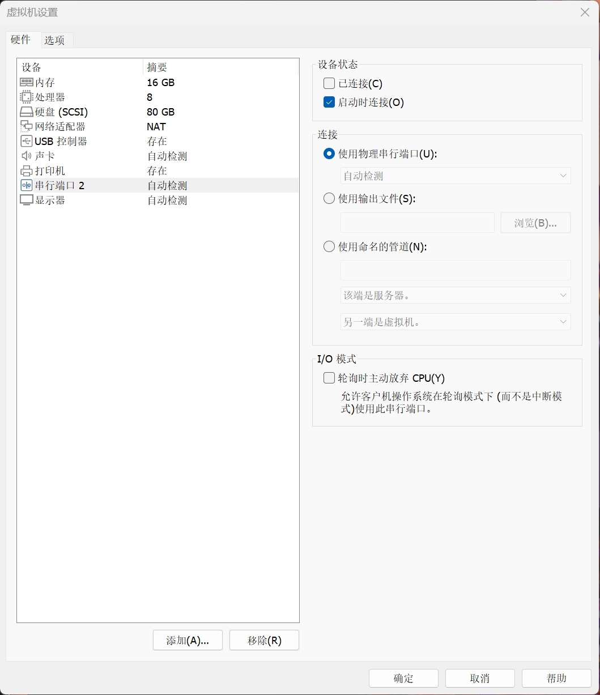
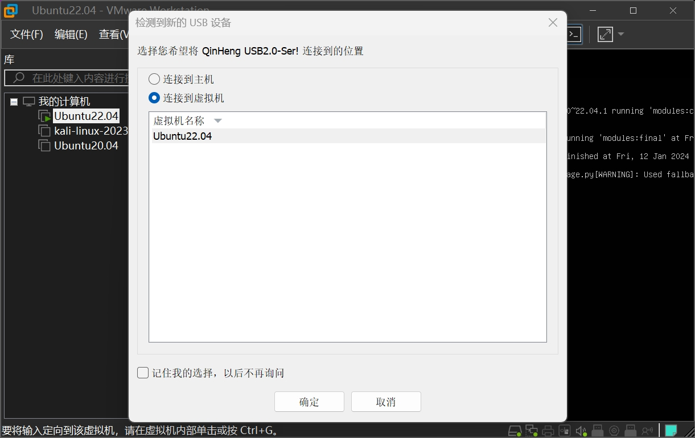

## 参考文档

- [ESP8266 RTOS SDK Programming Guide](https://docs.espressif.com/projects/esp8266-rtos-sdk/en/latest/get-started/index.html)
- [ESP8266_RTOS_SDK](https://github.com/espressif/ESP8266_RTOS_SDK)

## Get Started

This document is intended to help users set up the software environment for development of applications using hardware based on the Espressif ESP8266EX. Through a simple example we would like to illustrate how to use ESP8266_RTOS_SDK (ESP-IDF Style), including the menu based configuration, compiling the ESP8266_RTOS_SDK and firmware download to ESP8266EX boards.

## Introduction

The ESP8266EX microcontroller integrates a Tensilica L106 32-bit RISC processor, which achieves extra-low power consumption and reaches a maximum clock speed of 160 MHz. The Real-Time Operating System (RTOS) and Wi-Fi stack allow about 80% of the processing power to be available for user application programming and development.

Espressif provides the basic hardware and software resources that help application developers to build their ideas around the ESP8266EX series hardware. The software development framework by Espressif is intended for rapidly developing Internet-of-Things (IoT) applications, with Wi-Fi, power management and several other system features.

## Developing With the ESP8266_RTOS_SDK

### Get toolchain

v8.4.0

- [Windows](https://dl.espressif.com/dl/xtensa-lx106-elf-gcc8_4_0-esp-2020r3-win32.zip)
- [Mac](https://dl.espressif.com/dl/xtensa-lx106-elf-gcc8_4_0-esp-2020r3-macos.tar.gz)
- [Linux(64)](https://dl.espressif.com/dl/xtensa-lx106-elf-gcc8_4_0-esp-2020r3-linux-amd64.tar.gz)
- [Linux(32)](https://dl.espressif.com/dl/xtensa-lx106-elf-gcc8_4_0-esp-2020r3-linux-i686.tar.gz)

If you are still using old version SDK(< 3.0), please use toolchain v4.8.5, as following:

- [Windows](https://dl.espressif.com/dl/xtensa-lx106-elf-win32-1.22.0-88-gde0bdc1-4.8.5.tar.gz)
- [Mac](https://dl.espressif.com/dl/xtensa-lx106-elf-osx-1.22.0-88-gde0bdc1-4.8.5.tar.gz)
- [Linux(64)](https://dl.espressif.com/dl/xtensa-lx106-elf-linux64-1.22.0-88-gde0bdc1-4.8.5.tar.gz)
- [Linux(32)](https://dl.espressif.com/dl/xtensa-lx106-elf-linux32-1.22.0-88-gde0bdc1-4.8.5.tar.gz)

### Setup Toolchain

Download this file, then extract it in `~/esp` directory:

```sh
mkdir -p ~/esp
cd ~/esp
tar -xzf ~/Downloads/xtensa-lx106-elf-linux64-1.22.0-100-ge567ec7-5.2.0.tar.gz
```

The toolchain will be extracted into `~/esp/xtensa-lx106-elf/` directory.

To use it, you will need to update your `PATH` environment variable in `~/.profile` file. To make `xtensa-lx106-elf` available for all terminal sessions, add the following line to your `~/.profile` file:

```sh
export PATH="$PATH:$HOME/esp/xtensa-lx106-elf/bin"
```

Alternatively, you may create an alias for the above command. This way you can get the toolchain only when you need it. To do this, add different line to your `~/.profile` file:

```sh
alias get_lx106='export PATH="$PATH:$HOME/esp/xtensa-lx106-elf/bin"'
```

Then when you need the toolchain you can type `get_lx106` on the command line and the toolchain will be added to your `PATH`.

::: info Note
If you have `/bin/bash` set as login shell, and both `.bash_profile` and `.profile` exist, then update `.bash_profile` instead.
:::

Log off and log in back to make the .profile changes effective. Run the following command to verify if PATH is correctly set:

```sh
printenv PATH
```

You are looking for similar result containing toolchain’s path at the end of displayed string:

```sh
$ printenv PATH
/home/user-name/bin:/home/user-name/.local/bin:/usr/local/sbin:/usr/local/bin:/usr/sbin:/usr/bin:/sbin:/bin:/usr/games:/usr/local/games:/snap/bin:/home/user-name/esp/xtense-lx106-elf/bin
```

Instead of `/home/user-name` there should be a home path specific to your installation.

### Permission issues /dev/ttyUSB0

With some Linux distributions you may get the `Failed to open port /dev/ttyUSB0` error message when flashing the ESP8266.

If this happens you may need to add your current user to the correct group (commonly “dialout”) which has the appropriate permissions:

```sh
sudo usermod -a -G dialout $USER
```

In addition, you can also use “sudo chmod” to set permissions on the “/dev/ttyUSB0” file before running the make command to resolve:

```sh
sudo chmod -R 777 /dev/ttyUSB0
```

If you want to check which serial ports are available, you can use the following command:

```sh
sudo dmesg | grep ttyS*
```

You are looking for a line similar to this:

```sh
lurj@lurj:~$ sudo dmesg | grep ttyS*
[sudo] password for lurj:
[    2.797442] printk: console [tty0] enabled
[    4.669863] 00:05: ttyS0 at I/O 0x3f8 (irq = 4, base_baud = 115200) is a 16550A
[    4.762274] 00:06: ttyS1 at I/O 0x2f8 (irq = 3, base_baud = 115200) is a 16550A
[ 5659.082997] ch341-uart ttyUSB0: break control not supported, using simulated break
[ 5659.084082] usb 2-2.1: ch341-uart converter now attached to ttyUSB0
[ 6258.526072] ch341-uart ttyUSB0: ch341-uart converter now disconnected from ttyUSB0
[ 9450.323388] ch341-uart ttyUSB0: break control not supported, using simulated break
[ 9450.323720] usb 2-2.1: ch341-uart converter now attached to ttyUSB0
[18277.962687] ch341-uart ttyUSB0: ch341-uart converter now disconnected from ttyUSB0
```

### Get ESP8266_RTOS_SDK

Besides the toolchain (that contains programs to compile and build the application), you also need ESP8266 specific API / libraries. They are provided by Espressif in [ESP8266_RTOS_SDK](https://github.com/espressif/ESP8266_RTOS_SDK) repository. To get it, open terminal, navigate to the directory you want to put ESP8266_RTOS_SDK, and clone it using `git clone` command:

```sh
cd ~/esp
git clone --depth 1 https://github.com/espressif/ESP8266_RTOS_SDK.git
```

ESP8266_RTOS_SDK will be downloaded into `~/esp/ESP8266_RTOS_SDK`.

`--depth 1` means that only the latest commit will be downloaded.

### Setup Path to ESP8266_RTOS_SDK

The toolchain programs access ESP8266_RTOS_SDK using `IDF_PATH` environment variable. This variable should be set up on your PC, otherwise projects will not build. Setting may be done manually, each time PC is restarted. Another option is to set up it permanently by defining `IDF_PATH` in user profile.

For manually, the command:

```sh
export IDF_PATH=~/esp/ESP8266_RTOS_SDK
```

### Install the Required Python Packages

Create a virtual environment for ESP8266_RTOS_SDK. This is optional, but recommended. It will allow you to install the required Python packages without affecting the rest of your system.

```sh
conda create -n esp python=2.7
conda activate esp
```

Python packages required by ESP8266_RTOS_SDK are located in the `$IDF_PATH/requirements.txt` file. You can install them by running:

```sh
python -m pip install -r $IDF_PATH/requirements.txt
```

### Start a Project

Now you are ready to prepare your application for ESP8266. To start off quickly, we can use `examples/get-started/hello_world` project from `examples` directory in SDK.

Once you've found the project you want to work with, change to its directory and you can configure and build it.

### Connect

You are almost there. To be able to proceed further, connect ESP8266 board to PC, check under what serial port the board is visible and verify if serial communication works. Note the port number, as it will be required in the next step.

### Configuring the Project

Being in terminal window, go to directory of `hello_world` application by typing `cd ~/esp/ESP8266_RTOS_SDK/examples/get-started/hello_world`. Then start project configuration utility `menuconfig`:

```sh
cd ~/esp/ESP8266_RTOS_SDK/examples/get-started/hello_world
make menuconfig
```

In the menu, navigate to `Serial flasher config` > `Default serial port` to configure the serial port, where project will be loaded to. Confirm selection by pressing enter, save configuration by selecting `< Save >` and then exit application by selecting `< Exit >`.

> Note:
 On Windows, serial ports have names like COM1. On MacOS, they start with `/dev/cu.`. On Linux, they start with `/dev/tty`.

Here are couple of tips on navigation and use of `menuconfig`:

- Use up & down arrow keys to navigate the menu.
- Use Enter key to go into a submenu, Escape key to go out or to exit.
- Type `?` to see a help screen. Enter key exits the help screen.
- Use Space key, or `Y` and `N` keys to enable (Yes) and disable (No) configuration items with checkboxes "`[*]`"
- Pressing `?` while highlighting a configuration item displays help about that item.
- Type `/` to search the configuration items.

Once done configuring, press Escape multiple times to exit and say "Yes" to save the new configuration when prompted.

### Compiling the Project

`make all`

... will compile app based on the config.

### Flashing the Project

When `make all` finishes, it will print a command line to use esptool.py to flash the chip. However you can also do this from make by running:

`make flash`

This will flash the entire project (app, bootloader and init data bin) to a new chip. The settings for serial port flashing can be configured with `make menuconfig`.

You don't need to run `make all` before running `make flash`, `make flash` will automatically rebuild anything which needs it.

### Viewing Serial Output

The `make monitor` target uses the [idf_monitor tool](https://esp-idf.readthedocs.io/en/latest/get-started/idf-monitor.html) to display serial output from the ESP32. idf_monitor also has a range of features to decode crash output and interact with the device. [Check the documentation page for details](https://esp-idf.readthedocs.io/en/latest/get-started/idf-monitor.html).

Exit the monitor by typing Ctrl-].

To flash and monitor output in one pass, you can run:

`make flash monitor`

### Compiling & Flashing Just the App

After the initial flash, you may just want to build and flash just your app, not the bootloader and init data bin:

- `make app` - build just the app.
- `make app-flash` - flash just the app.

`make app-flash` will automatically rebuild the app if it needs it.

(In normal development there's no downside to reflashing the bootloader and init data bin each time, if they haven't changed.)

> Note:
> Recommend to use these 2 commands if you have flashed bootloader and init data bin.

### Parallel Builds

ESP8266_RTOS_SDK supports compiling multiple files in parallel, so all of the above commands can be run as `make -jN` where `N` is the number of parallel make processes to run (generally N should be equal to or one more than the number of CPU cores in your system.)

Multiple make functions can be combined into one. For example: to build the app & bootloader using 5 jobs in parallel, then flash everything, and then display serial output from the ESP32 run:

```sh
make -j5 app-flash monitor
```

### Erasing Flash

The `make flash` target does not erase the entire flash contents. However it is sometimes useful to set the device back to a totally erased state. To erase the entire flash, run `make erase_flash`.

This can be combined with other targets, ie `make erase_flash flash` will erase everything and then re-flash the new app, bootloader and init data bin.

### Updating ESP8266_RTOS_SDK

After some time of using ESP8266_RTOS_SDK-IDF, you may want to update it to take advantage of new features or bug fixes. The simplest way to do so is by deleting existing `ESP8266_RTOS_SDK` folder and cloning it again.

Another solution is to update only what has changed. This method is useful if you have a slow connection to GitHub. To do the update run the following commands::

```sh
cd ~/esp/ESP8266_RTOS_SDK
git pull
```

The ``git pull`` command is fetching and merging changes from ESP8266_RTOS_SDK repository on GitHub.

### Ubuntu VMware



