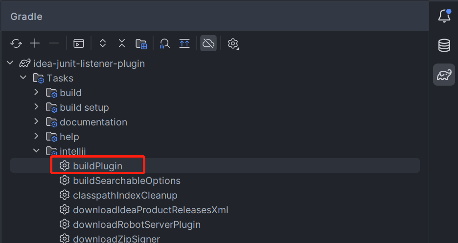

## 介绍

JUnit Listener是一个Junit的监听器，可以用来监听Junit的执行过程，比如在测试用例执行前后做一些操作，比如在测试用例执行失败后做一些操作。本文主要介绍几种实现方式。

## 一、eclipse插件

### 1.1 介绍

在eclipse中，可以通过插件的方式来实现Junit Listener，这种方式的好处是可以在eclipse中直接使用，不需要额外的配置。

### 1.2 创建插件工程

在eclipse中，点击help->Install New Software，然后在Work with中选择`--All Available Sites--`，然后在Find中输入Eclipse Plug-in Development Environment，然后点击Next，然后一直点击Next，直到安装完成，如下图所示：


点击File->New->Other，选择Plug-in Project，然后点击Next，然后输入项目名称，然后点击Next，然后选择`This plug-in will make contributions to the UI`，然后点击Next，输入项目名称。


点击Create a plug-in using a template选择Hello World Command，然后点击Next，然后点击Finish，如下图所示：


### 1.3 创建Junit Listener

点击`plugn.xml`，然后点击Extensions，然后点击Add，然后选择org.junit.runner.notification.RunListener，然后点击Finish，如下图所示：


也可以直接在`plugin.xml`中添加如下代码：

```xml
<?xml version="1.0" encoding="UTF-8"?>
<?eclipse version="3.4"?>
<plugin>

   <extension
         point="org.eclipse.jdt.junit.testRunListeners">
      <testRunListener
            class="eclipse.junit.listener.plugin.handlers.JunitTestRunListener">
      </testRunListener>
   </extension>

</plugin>
```

### 1.4 实现Junit Listener

```java
public class JunitTestRunListener extends TestRunListener
{
    /**
     * A test run session has finished. The test tree can be accessed through
     * the session element.
     *
     * <p>
     * Important: The implementor of this method must not keep the session
     * element when the method is finished.
     * </p>
     *
     * @param session
     *            the test
     */
    @Override
    public void sessionFinished(ITestRunSession session) {
    }
}
```

### 1.5 引入jar包

在`plugin.xml`中点击`Runtime`，然后找到`Classpate`点击Add，然后选择需要引入的jar包即可，如下图所示：


### 1.6 启动调试

在`plugin.xml`中点击`Overview`，然后点击Launch an Eclipse application in Debug mode，然后点击Launch，如下图所示：


### 1.7 导出插件

选择项目右键点击Export，然后选择Plug-in Development->Deployable plug-ins and fragments，然后点击Next，然后选择项目，然后点击Finish，如下图所示：


## 二、idea插件

### 2.1 介绍

在idea中，可以通过插件的方式来实现Junit Listener，这种方式的好处是可以在idea中直接使用，不需要额外的配置。

### 2.2 创建插件工程

点击File->New->Project，然后选择IDE Plugin，然后输入项目名称，然后点击Next，然后点击Finish，如下图所示：


### 2.3 创建Junit Listener

编辑`plugin.xml`，在`<extensions defaultExtensionNs="com.intellij">`中添加如下代码：

```xml
<extensions defaultExtensionNs="com.intellij">
    <testStatusListener implementation="com.original.idea.junit.listener.JunitTestStatusListener"/>
</extensions>
```

### 2.4 实现Junit Listener

```java
public class JunitTestStatusListener extends TestStatusListener {
    @Override
    public void testSuiteFinished(@Nullable AbstractTestProxy root) {
    }
}
```

### 2.5 引入jar包

编辑`build.gradle.kts`添加如下代码：

```kotlin
dependencies{
    implementation("com.alibaba:fastjson:1.2.83")
}
```

### 2.6 启动调试

点击侧边栏`gradle`，然后点击`Tasks->intellij->runIde`，然后点击调试运行。

### 2.7 导出插件

点击侧边栏`gradle`，然后点击`Tasks->intellij->buildPlugin`，然后点击运行，如下图所示：


