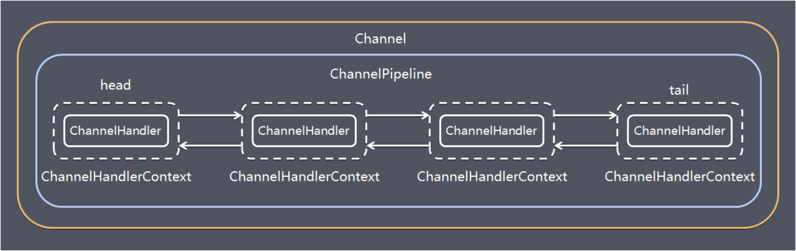
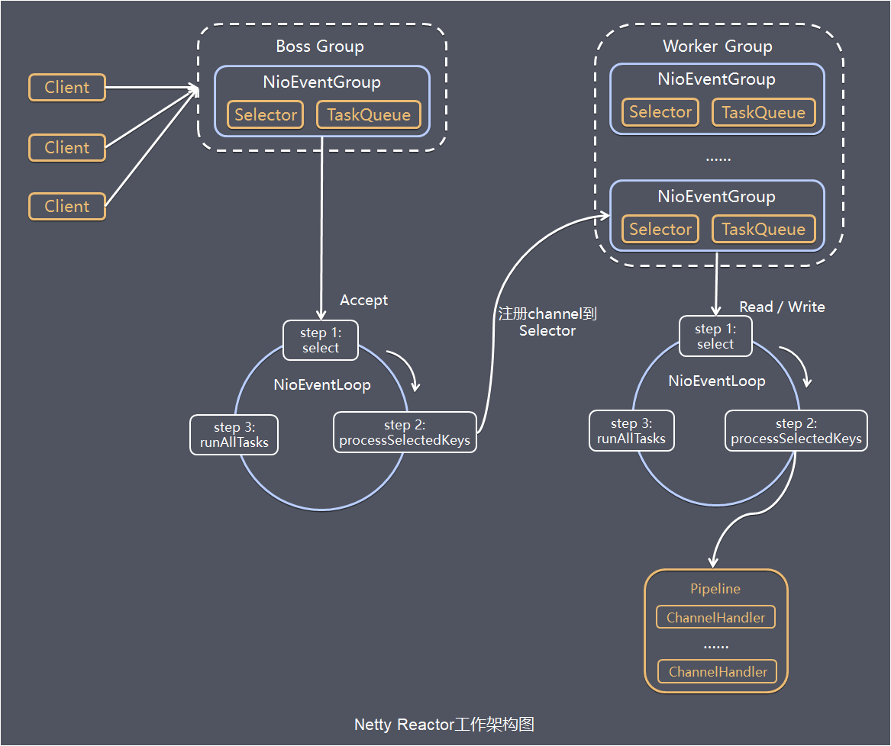

## Netty概述

`Netty`是一个异步事件驱动的网络应用程序框架，用于快速开发可维护的高性能协议服务器和客户端。

`Netty`对`JDK`自带的NIO的API进行了良好的封装，解决了上述问题。且`Netty`拥有高性能、吞吐量更高，延迟更低，减少资源消耗，最小化不必要的内存复制等优点。

`Netty`现在都在用的是4.x，5.x版本已经废弃，Netty4.x需要JDK 6以上版本支持。

开源地址：<https://github.com/netty/netty>

## 为什么使用Netty

### NIO的缺点

NIO的主要问题是：

- NIO的类库和API繁杂，学习成本高，你需要熟练掌握Selector、ServerSocketChannel、SocketChannel、ByteBuffer等。
- 需要熟悉Java多线程编程。这是因为NIO编程涉及到Reactor模式，你必须对多线程和网络编程非常熟悉，才能写出高质量的NIO程序。
- 臭名昭著的 epoll bug。它会导致Selector空轮询，最终导致CPU 100%。直到JDK1.7版本依然没得到根本性的解决。

### Netty的优点

- 使用简单：封装了`NIO`的很多细节，使用更简单。
- 功能强大：预置了多种编解码功能，支持多种主流协议。
- 定制能力强：可以通过`ChannelHandler`对通信框架进行灵活地扩展。
- 性能高：通过与其他业界主流的`NIO`框架对比，`Netty`的综合性能最优。
- 稳定：`Netty`修复了已经发现的所有`NIO`的bug，让开发人员可以专注于业务本身。
- 社区活跃：`Netty`是活跃的开源项目，版本迭代周期短，bug修复速度快。

## Netty的使用场景

互联网行业：在分布式系统中，各个节点之间需要远程服务调用，高性能的`RPC`框架必不可少，`Netty`作为异步高性能的通信框架，往往作为基础通信组件被这些`RPC`框架使用。典型的应用有：阿里分布式服务框架`Dubbo`的`RPC`框架使用`Dubbo`协议进行节点间通信，`Dubbo`协议默认使用`Netty`作为基础通信组件，用于实现。各进程节点之间的内部通信。`Rocketmq`底层也是用的`Netty`作为基础通信组件。

游戏行业：无论是手游服务端还是大型的网络游戏，`Java`语言得到了越来越广泛的应用。`Netty`作为高性能的基础通信组件，它本身提供了`TCP/UDP`和`HTTP`协议栈。

大数据领域：经典的 Hadoop 的高性能通信和序列化组件`Avro`的`RPC`框架，默认采用`Netty`进行跨界点通信，它的`Netty Service`基于`Netty`框架二次封装实现。

## Netty的特点

`Netty`的对`JDK`自带的NIO的API进行封装，解决上述问题，主要特点有：

- 设计优雅 适用于各种传输类型的统一API - 阻塞和非阻塞Socket基于灵活且可扩展的事件模型，可以清晰地分离关注点高度可定制的线程模型-单线程，一个或多个线程池真正的无连接数据报套接字支持（自3.1起）
- 高性能 、高吞吐、低延迟、低消耗
- 最小化不必要的内存复制
- 安全完整的`SSL/TLS`和StartTLS支持
- 高并发：`Netty`是一款基于NIO（Nonblocking IO，非阻塞IO）开发的网络通信框架，对比于BIO（Blocking I/O，阻塞IO），他的并发性能得到了很大提高。
- 传输快：Netty 的传输依赖于零拷贝特性，尽量减少不必要的内存拷贝，实现了更高效率的传输。
- 封装好：Netty 封装了 NIO 操作的很多细节，提供了易于使用调用接口。
- 社区活跃，不断更新 社区活跃，版本迭代周期短，发现的BUG可以被及时修复，同时，更多的新功能会被加入
- 使用方便详细记录的Javadoc，用户指南和示例没有其他依赖项，JDK 5（Netty 3.x）或6（Netty 4.x）就足够了

## Netty的架构

### 功能特性


- 传输服务支持BIO和NIO
- 容器集成支持OSGI、JBossMC、Spring、Guice容器
- 协议支持HTTP、Protobuf、二进制、文本、WebSocket等一系列常见协议都支持。 还支持通过实行编码解码逻辑来实现自定义协议
- Core核心可扩展事件模型、通用通信API、支持零拷贝的ByteBuf缓冲对象

### 核心组件

#### Bootstrap、ServerBootstrap

Bootstrap意思是引导，一个Netty应用通常由一个Bootstrap开始，主要作用是配置整个Netty程序，串联各个组件，Netty中Bootstrap类是客户端程序的启动引导类，ServerBootstrap是服务端启动引导类。

#### Future、ChannelFuture

正如前面介绍，在Netty中所有的IO操作都是异步的，不能立刻得知消息是否被正确处理，但是可以过一会等它执行完成或者直接注册一个监听，具体的实现就是通过Future和ChannelFutures，他们可以注册一个监听，当操作执行成功或失败时监听会自动触发注册的监听事件。

#### Channel

Netty网络通信的组件，能够用于执行网络I/O操作。Channel为用户提供：

- 当前网络连接的通道的状态（例如是否打开？是否已连接？）
- 网络连接的配置参数（例如接收缓冲区大小）
- 提供异步的网络`I/O`操作(如建立连接，读写，绑定端口)，异步调用意味着任何`I/O`调用都将立即返回，并且不保证在调用结束时所请求的`I/O`操作已完成。调用立即返回一个ChannelFuture实例，通过注册监听器到ChannelFuture上，可以`I/O`操作成功、失败或取消时回调通知调用方。
- 支持关联`I/O`操作与对应的处理程序

不同协议、不同的阻塞类型的连接都有不同的Channel类型与之对应，下面是一些常用的Channel类型

- NioSocketChannel，异步的客户端TCP Socket连接
- NioServerSocketChannel，异步的服务器端TCP Socket 连接
- NioDatagramChannel，异步的UDP连接
- NioSctpChannel，异步的客户端Sctp连接
- NioSctpServerChannel，异步的Sctp服务器端连接 这些通道涵盖了UDP和TCP网络IO以及文件IO.

#### Selector

Netty基于Selector对象实现I/O多路复用，通过 Selector, 一个线程可以监听多个连接的Channel事件, 当向一个Selector中注册Channel 后，Selector 内部的机制就可以自动不断地查询(select) 这些注册的Channel是否有已就绪的I/O事件(例如可读, 可写, 网络连接完成等)，这样程序就可以很简单地使用一个线程高效地管理多个Channel。

#### NioEventLoop

NioEventLoop中维护了一个线程和任务队列，支持异步提交执行任务，线程启动时会调用NioEventLoop的run方法，执行I/O任务和非I/O任务：

- I/O任务 即selectionKey中ready的事件，如accept、connect、read、write等，由processSelectedKeys方法触发。
- 非IO任务 添加到taskQueue中的任务，如register0、bind0等任务，由runAllTasks方法触发。

两种任务的执行时间比由变量ioRatio控制，默认为50，则表示允许非IO任务执行的时间与IO任务的执行时间相等。

#### NioEventLoopGroup

NioEventLoopGroup，主要管理eventLoop的生命周期，可以理解为一个线程池，内部维护了一组线程，每个线程(NioEventLoop)负责处理多个Channel上的事件，而一个Channel只对应于一个线程。

#### ChannelHandler

ChannelHandler是一个接口，处理I / O事件或拦截I / O操作，并将其转发到其ChannelPipeline(业务处理链)中的下一个处理程序。

ChannelHandler本身并没有提供很多方法，因为这个接口有许多的方法需要实现，方便使用期间，可以继承它的子类：

- ChannelInboundHandler用于处理入站I/O事件
- ChannelOutboundHandler用于处理出站I/O操作

或者使用以下适配器类：

- ChannelInboundHandlerAdapter用于处理入站I/O事件
- ChannelOutboundHandlerAdapter用于处理出站I/O操作
- ChannelDuplexHandler用于处理入站和出站事件

#### ChannelHandlerContext

保存Channel相关的所有上下文信息，同时关联一个ChannelHandler对象

#### ChannelPipeline

保存ChannelHandler的List，用于处理或拦截Channel的入站事件和出站操作。 ChannelPipeline实现了一种高级形式的拦截过滤器模式，使用户可以完全控制事件的处理方式，以及Channel中各个的ChannelHandler如何相互交互。

下图引用Netty的Javadoc4.1中ChannelPipline的说明，描述了ChannelPipeline中ChannelHandler通常如何处理I/O事件。 I/O事件由ChannelInboundHandler或ChannelOutboundHandler处理，并通过调用ChannelHandlerContext中定义的事件传播方法（例如ChannelHandlerContext.fireChannelRead（Object）和ChannelOutboundInvoker.write（Object））转发到其最近的处理程序。

```txt
                                                 I/O Request
                                            via Channel or
                                        ChannelHandlerContext
                                                      |
  +---------------------------------------------------+---------------+
  |                           ChannelPipeline         |               |
  |                                                  \|/              |
  |    +---------------------+            +-----------+----------+    |
  |    | Inbound Handler  N  |            | Outbound Handler  1  |    |
  |    +----------+----------+            +-----------+----------+    |
  |              /|\                                  |               |
  |               |                                  \|/              |
  |    +----------+----------+            +-----------+----------+    |
  |    | Inbound Handler N-1 |            | Outbound Handler  2  |    |
  |    +----------+----------+            +-----------+----------+    |
  |              /|\                                  .               |
  |               .                                   .               |
  | ChannelHandlerContext.fireIN_EVT() ChannelHandlerContext.OUT_EVT()|
  |        [ method call]                       [method call]         |
  |               .                                   .               |
  |               .                                  \|/              |
  |    +----------+----------+            +-----------+----------+    |
  |    | Inbound Handler  2  |            | Outbound Handler M-1 |    |
  |    +----------+----------+            +-----------+----------+    |
  |              /|\                                  |               |
  |               |                                  \|/              |
  |    +----------+----------+            +-----------+----------+    |
  |    | Inbound Handler  1  |            | Outbound Handler  M  |    |
  |    +----------+----------+            +-----------+----------+    |
  |              /|\                                  |               |
  +---------------+-----------------------------------+---------------+
                  |                                  \|/
  +---------------+-----------------------------------+---------------+
  |               |                                   |               |
  |       [ Socket.read() ]                    [ Socket.write() ]     |
  |                                                                   |
  |  Netty Internal I/O Threads (Transport Implementation)            |
  +-------------------------------------------------------------------+

123456789101112131415161718192021222324252627282930313233343536373839
```

入站事件由自下而上方向的入站处理程序处理，如图左侧所示。入站Handler处理程序通常处理由图底部的I/O线程生成的入站数据。通常通过实际输入操作（例如SocketChannel.read（ByteBuffer））从远程读取入站数据。

出站事件由上下方向处理，如图右侧所示。 出站Handler处理程序通常会生成或转换出站传输，例如write请求。 I/O线程通常执行实际的输出操作，例如SocketChannel.write（ByteBuffer）。

在`Netty`中每个`Channel`都有且仅有一个`ChannelPipeline`与之对应, 它们的组成关系如下:



一个`Channel`包含了一个`ChannelPipeline`, 而`ChannelPipeline`中又维护了一个由`ChannelHandlerContext`组成的双向链表, 并且每个`ChannelHandlerContext`中又关联着一个`ChannelHandler`。入站事件和出站事件在一个双向链表中，入站事件会从链表head往后传递到最后一个入站的handler，出站事件会从链表tail往前传递到最前一个出站的handler，两种类型的handler互不干扰。

## Netty服务端过程初始化并启动过程

初始化并启动Netty服务端过程如下：

```java
public static void main(String[] args) {
    // 创建mainReactor
    NioEventLoopGroup boosGroup = new NioEventLoopGroup();
    // 创建工作线程组
    NioEventLoopGroup workerGroup = new NioEventLoopGroup();

    final ServerBootstrap serverBootstrap = new ServerBootstrap();
    serverBootstrap 
                // 组装NioEventLoopGroup 
            .group(boosGroup, workerGroup)
                // 设置channel类型为NIO类型
            .channel(NioServerSocketChannel.class)
            // 设置连接配置参数
            .option(ChannelOption.SO_BACKLOG, 1024)
            .childOption(ChannelOption.SO_KEEPALIVE, true)
            .childOption(ChannelOption.TCP_NODELAY, true)
            // 配置入站、出站事件handler
            .childHandler(new ChannelInitializer<NioSocketChannel>() {
                @Override
                protected void initChannel(NioSocketChannel ch) {
                    // 配置入站、出站事件channel
                    ch.pipeline().addLast(...);
                    ch.pipeline().addLast(...);
                }
            });

    // 绑定端口
    int port = 8080;
    serverBootstrap.bind(port).addListener(future -> {
        if (future.isSuccess()) {
            System.out.println(new Date() + ": 端口[" + port + "]绑定成功!");
        } else {
            System.err.println("端口[" + port + "]绑定失败!");
        }
    });
}
```

基本过程如下：

1. 初始化创建2个NioEventLoopGroup，其中boosGroup用于Accetpt连接建立事件并分发请求， workerGroup用于处理I/O读写事件和业务逻辑
1. 基于ServerBootstrap(服务端启动引导类)，配置EventLoopGroup、Channel类型，连接参数、配置入站、出站事件handler
1. 绑定端口，开始工作

## 服务端Netty的工作架构图

结合上面的介绍的Netty Reactor模型，介绍服务端Netty的工作架构图：



server端包含1个Boss NioEventLoopGroup和1个Worker NioEventLoopGroup，NioEventLoopGroup相当于1个事件循环组，这个组里包含多个事件循环NioEventLoop，每个NioEventLoop包含1个selector和1个事件循环线程。

每个Boss NioEventLoop循环执行的任务包含3步：

1. 轮询accept事件
1. 处理accept I/O事件，与Client建立连接，生成NioSocketChannel，并将NioSocketChannel注册到某个Worker NioEventLoop的Selector上
1. 处理任务队列中的任务，runAllTasks。

任务队列中的任务包括用户调用eventloop.execute或schedule执行的任务，或者其它线程提交到该eventloop的任务。

每个Worker NioEventLoop循环执行的任务包含3步：

1. 轮询read、write事件；
1. 处I/O事件，即read、write事件，在NioSocketChannel可读、可写事件发生时进行处理
1. 处理任务队列中的任务，runAllTasks。

## 示例项目

- <https://github.com/waylau/netty-4-user-guide>
- <https://github.com/waylau/netty-4-user-guide-demos>
- <https://github.com/fuzhengwei/itstack-demo-netty>
- <https://github.com/fuzhengwei/itstack-demo-rpc>

## 参考文献

- <https://blog.csdn.net/crazymakercircle/article/details/124588880>
- <https://zhuanlan.zhihu.com/p/474844021>
